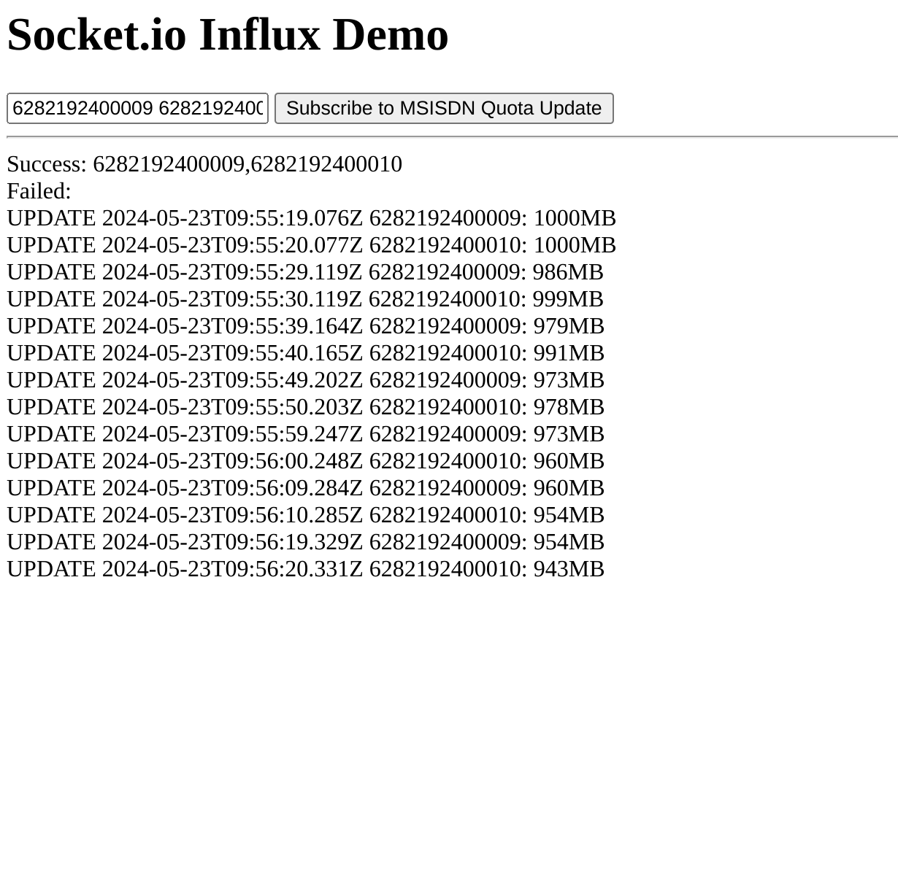

# INFLUXDB SOCKET IO DEMO
Demo for InfluxDB and Socket.io usage to show realtime data updates

## Services

### Data Retriever
- Retrieves data periodically, stores the data to InfluxDB, and sends the data to a message queue.

### Backend
- Exposes a REST API to retrieve time series history of data from InfluxDB.
- Receives subscription request from a client through socket.io and assigns client to a room. 
- Service periodically receives data from message queue and sends it to corresponding rooms.

### Frontend
- Sends a subscription request through socket.io to backend server. If it succeeds, frontend will receive new data in real time.

## Sample Result
